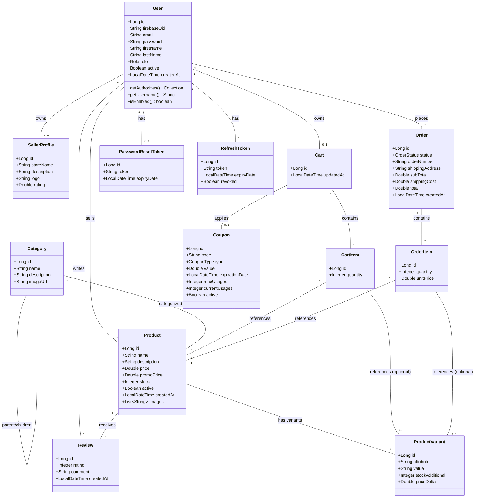

# Analyse du Modèle de Données et Diagramme de Classes (ShopFlow)

Ce document présente l'analyse complète des entités JPA du projet ShopFlow, de leurs attributs, de leurs méthodes (le cas échéant) et de leurs relations. Il peut être utilisé pour générer ou comprendre le diagramme de classes de l'application.

## 1. Diagramme de Classes (Mermaid)

---

## 2. Dictionnaire des Entités et Relations

Toutes les classes utilisent **Lombok** (`@Getter`, `@Setter`, `@Builder`) qui génère automatiquement les fonctions classiques d'accès et de modification pour chaque attribut. 

### 👤 `User`
Implémente `UserDetails` (Spring Security). Gère les informations des utilisateurs quel que soit leur rôle.
*   **Attributs** : `id` (PK), `firebaseUid` (Unique), `email` (Unique), `password`, `firstName`, `lastName`, `role` (Enum: ADMIN, SELLER, CUSTOMER), `active`, `createdAt`.
*   **Méthodes d'interface** : `getAuthorities()`, `getUsername()`, `isAccountNonExpired()`, `isAccountNonLocked()`, `isCredentialsNonExpired()`, `isEnabled()`.

### 🏪 `SellerProfile`
Profil public et informations pour un utilisateur ayant le rôle SELLER.
*   **Attributs** : `id` (PK), `storeName`, `description`, `logo`, `rating`.
*   **Relations** : 
    *   `@OneToOne` avec `User` (clé étrangère `user_id`).

### 📦 `Product`
Le cœur du catalogue.
*   **Attributs** : `id` (PK), `name`, `description`, `price`, `promoPrice`, `stock`, `active`, `createdAt`, `images` (`@ElementCollection` de Strings).
*   **Relations** :
    *   `@ManyToOne` avec `User` (vendeur).
    *   `@ManyToMany` avec `Category`.
    *   `@OneToMany` avec `ProductVariant` (Cascade ALL).
    *   `@OneToMany` avec `Review` (Cascade ALL).

### 🏷️ `ProductVariant`
Les options d'un produit (ex: Taille L, Couleur Rouge).
*   **Attributs** : `id` (PK), `attribute` (ex: "Size"), `value` (ex: "L"), `stockAdditional`, `priceDelta` (supplément de prix).
*   **Relations** :
    *   `@ManyToOne` vers `Product`.

### 📂 `Category`
Arborescence des catégories de produits.
*   **Attributs** : `id` (PK), `name` (Unique), `description`, `imageUrl`.
*   **Relations** :
    *   `@ManyToOne` vers son parent `Category` (Auto-référencée).
    *   `@OneToMany` vers ses enfants `Category`.

### ⭐ `Review`
Avis laissés par les clients sur les produits.
*   **Attributs** : `id` (PK), `rating`, `comment`, `createdAt`.
*   **Relations** :
    *   `@ManyToOne` vers `Product`.
    *   `@ManyToOne` vers `User` (le client).

### 🛒 `Cart` & `CartItem`
Gestion du panier avant la commande.
*   **Cart** : `id` (PK), `updatedAt`.
    *   `@OneToOne` vers `User` (le client).
    *   `@OneToMany` vers `CartItem`.
    *   `@ManyToOne` vers `Coupon` (facultatif).
*   **CartItem** : `id` (PK), `quantity`.
    *   `@ManyToOne` vers `Cart`.
    *   `@ManyToOne` vers `Product`.
    *   `@ManyToOne` vers `ProductVariant` (facultatif).

### 📦 `Order` & `OrderItem`
Commande passée et validée (historique figé).
*   **Order** : `id` (PK), `status` (Enum), `orderNumber` (Unique), `shippingAddress`, `subTotal`, `shippingCost`, `total`, `createdAt`.
    *   `@ManyToOne` vers `User` (le client).
    *   `@OneToMany` vers `OrderItem`.
*   **OrderItem** : `id` (PK), `quantity`, `unitPrice` (Prix unitaire figé lors de l'achat).
    *   `@ManyToOne` vers `Order`.
    *   `@ManyToOne` vers `Product`.
    *   `@ManyToOne` vers `ProductVariant` (facultatif).

### 🎟️ `Coupon`
Codes de réduction.
*   **Attributs** : `id` (PK), `code` (Unique), `type` (Enum: PERCENT, FIXED), `value`, `expirationDate`, `maxUsages`, `currentUsages`, `active`.

### 🔐 `PasswordResetToken` & `RefreshToken`
Entités techniques pour la sécurité.
*   **PasswordResetToken** : `token` (Unique), `expiryDate`. `@OneToOne` vers `User`.
*   **RefreshToken** : `token` (Unique), `expiryDate`, `revoked`. `@ManyToOne` vers `User`.
